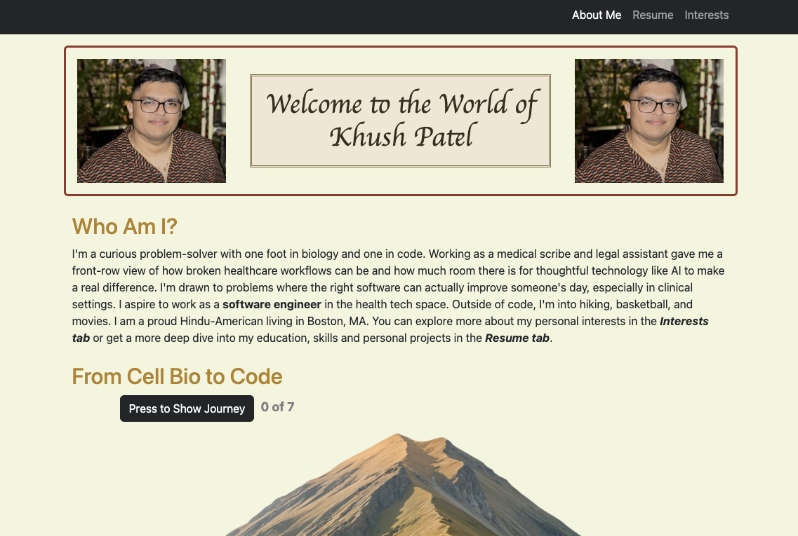
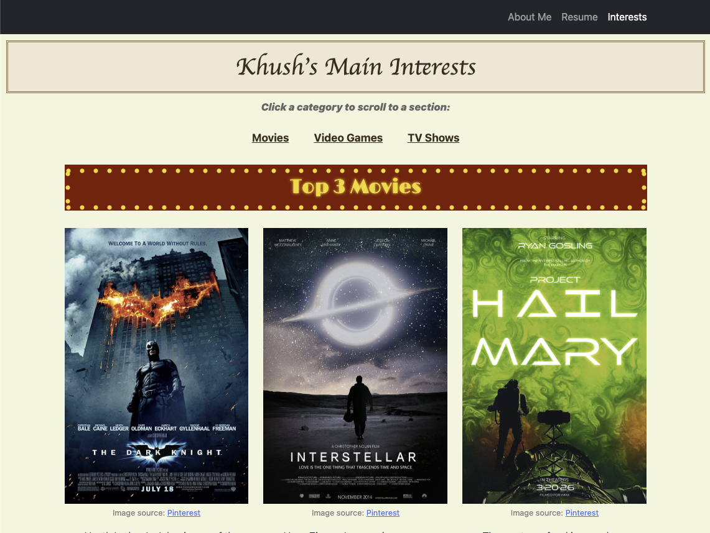
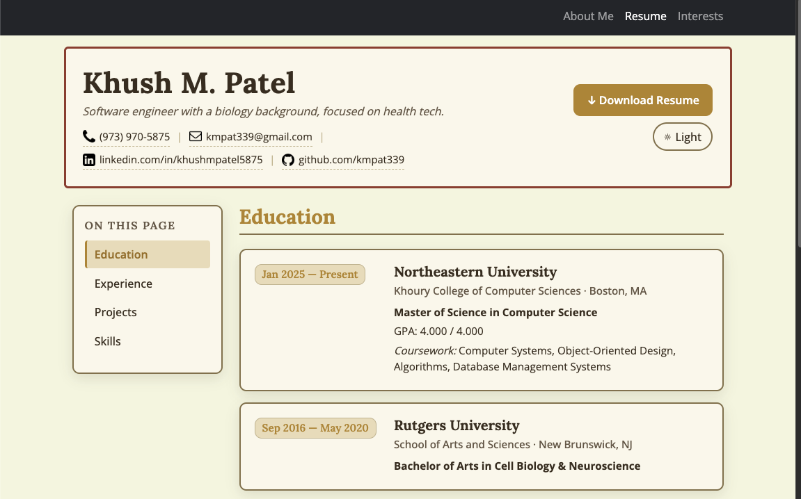

# Khush Patel's Homepage

A multi-page personal homepage built from scratch with HTML, CSS, Bootstrap 5, and vanilla JavaScript.

🔗 **Live Demo:** [https://kmpat339.github.io/khush-homepage/](https://kmpat339.github.io/khush-homepage/)

🎥 **Video Demo:** [Watch on YouTube](https://youtu.be/fuRSZ824yyo)



## About

This is my multi-page personal homepage built for CS5610 Web Development at Northeastern University. It introduces who I am, what I'm interested in, and what I've worked on, using a warm earthy color palette with a hand-built interactive mountain animation, a colorful interests page, and an AI-generated resume page.

## Pages

- **About Me** (`index.html`) — Introduction, my journey from cell biology to code, contact form
- **Interests** (`pages/interests.html`) — Tier-list style breakdown of my favorite movies, video games, and TV shows
- **Resume** (`pages/resume.html`) — AI-generated resume page with sticky sidebar, expandable cards, skill filtering, and a theme toggle

## Features

- **Interactive mountain journey** on the home page — click to walk the hiker up the mountain through milestones with animated bubbles
- **TV show tier list** styled like a classic gaming tier list with S/A/B/C tiers
- **Marquee-style** movie titles with a theater-bulb border made entirely from CSS gradients
- **Press Start 2P** retro font for the video games section with synthwave gradient background
- **AI-generated resume page** with sticky sidebar nav, scroll-triggered fade-ins, expandable job cards, skill pill filtering, dark mode toggle, and print-friendly styles

## Tech Stack

- **HTML5** — semantic markup
- **CSS3** — custom styling, gradients, animations, flexbox, custom properties
- **Bootstrap 5** — grid system and utility classes
- **Vanilla JavaScript (ES6 modules)** — interactivity, DOM manipulation, IntersectionObserver
- **Google Fonts** — Limelight, Press Start 2P, Cinzel Decorative, Lora, Open Sans
- **Reload** (dev server) — auto-refreshing on file changes
- **ESLint + Prettier** — code quality and formatting

## Install & Run

This site is pure static HTML/CSS/JS — no backend, no build step, no server-side code. If you just want to view it, you don't need to install anything (see Option 2). Option 1 is only for working on the project locally with live reload and lint/format tooling.

### Option 1 — Local dev server (with live reload)

**Prerequisites for this option only:**

- [Node.js](https://nodejs.org/) 18 or later (includes `npm`) — used only by the dev tooling (the live-reload server, ESLint, Prettier). The site itself does not need Node to run.
- [Git](https://git-scm.com/) — for cloning. You can also download the repo as a ZIP from GitHub instead.

1. Clone the repository:
   ```bash
   git clone https://github.com/kmpat339/khush-homepage.git
   cd khush-homepage
   ```

2. Install dependencies:
   ```bash
   npm install
   ```

   This pulls in everything listed under `devDependencies` in `package.json`:
   - **reload** — the live-reload dev server used by `npm start`
   - **eslint** + **@eslint/js** + **@eslint/css** + **globals** — JavaScript and CSS linting
   - **prettier** + **eslint-config-prettier** — code formatting (the config keeps ESLint and Prettier from fighting each other)

3. Start the dev server. The `-b` flag opens the site in your default browser automatically:
   ```bash
   npm start
   ```

4. The site will open at [http://localhost:8080](http://localhost:8080). Edits to HTML, CSS, or JS trigger an automatic page reload.

   *If port 8080 is already in use*, stop the other process or pass a different port to `reload` (see the [reload docs](https://www.npmjs.com/package/reload)).

### Option 2 — Open directly (no install needed)

If you just want to view the site without installing anything, open `index.html` in your browser. Everything works the same; you just don't get live reload.

## Project Structure

```
khush-homepage/
├── index.html
├── pages/
│   ├── interests.html
│   └── resume.html
├── css/
│   ├── style.css
│   └── resume.css
├── js/
│   ├── main.js
│   └── resume.js
├── images/
└── package.json
```

## Screenshots

### Home


### Interests


### Resume


## Author

**Khush Patel**
🌐 [Personal Homepage](https://kmpat339.github.io/khush-homepage/)
💼 [LinkedIn](https://www.linkedin.com/in/khushmpatel5875)
🐙 [GitHub](https://github.com/kmpat339)

## Academic Reference

This project was created as part of the **Web Development Course (Summer 2026)** at Northeastern University.

- **Course**: [CS5610 Web Development — Northeastern University](https://johnguerra.co/classes/webDevelopment_online_summer_2026/)
- **Instructor**: John Alexis Guerra Gómez

## Project Submissions

- **Design document:** [khush_homepage_design_document.pdf](./khush_homepage_design_document.pdf) (attached in this repo)
- **Slide deck:** [Google Slides](https://docs.google.com/presentation/d/1gM2A-Z4RqMXngKxdFgcAxlAgOwrOxrt8hGalLKYdVCA/edit?usp=sharing)
- **Video presentation:** [YouTube](https://youtu.be/fuRSZ824yyo)
- **Thumbnail image:** [thumbnail.png](https://kmpat339.github.io/khush-homepage/images/thumbnail.png)

## Use of GenAI Tools

This section discloses where generative AI was used in this project per the assignment requirements.

### Tools

- **Claude Opus 4.7** (Anthropic) — used in Claude Code CLI

### Where AI was used

1. **Resume page generation** — `pages/resume.html`, `css/resume.css`, and `js/resume.js` were generated from a master prompt in a single shot, followed by a few small follow-up prompts to fix bugs and add icons.

2. **Prompt refinement** — The master prompt itself was iteratively refined with Claude Opus 4.7 in a separate session before being sent to the resume-generating model. Ideas and structure were mine; the AI helped sharpen the specificity and phrasing.

3. **README first draft** — This README was first drafted from a prompt to Claude Opus 4.7 listing all the sections, content, and links to include. I edited and tweaked the result by hand.

### Where AI was NOT used

- All other HTML, CSS, and JavaScript (`index.html`, `pages/interests.html`, `css/style.css`, `js/main.js`) were hand-written from scratch.
- All images, posters, and icons were sourced from public web pages with attribution.
- Page structure, design choices, content (interests, movies, games, TV shows), and the overall theme were my own.

### Prompts used

- Full prompts used to generate the resume page: [prompts/resume-page-prompts.md](./prompts/resume-page-prompts.md)
- Prompt used to generate the first draft of this README: [prompts/readme-prompt.md](./prompts/readme-prompt.md)

## Image References

All images and icons used in this project were sourced from public web pages. Attribution for each file in `images/`:

### Illustrations

- `mountain.png` — [Magnific](https://www.magnific.com/free-psd/view-nature-mountain-landscape_269375071.htm)
- `hiker.png` — [Magnific](https://www.magnific.com/free-vector/explorer-with-backpack-background_4302663.htm)

### Movie posters

- `dark-knight.jpg` — [Pinterest](https://www.pinterest.com/pin/47006389852371756/)
- `interstellar.jpg` — [Pinterest](https://www.pinterest.com/pin/422281211101286/)
- `project-hail-mary.jpg` — [Pinterest](https://www.pinterest.com/pin/774124931625183/)

### Video game art

- `uncharted-4.jpg` — [Flickr](https://www.flickr.com/photos/josky/27026413645/)
- `assassins-black-flag.jpg` — [DeviantArt](https://www.deviantart.com/thesyanart/art/Assassin-s-Creed-IV-Black-Flag-Wallpaper-357839700)
- `super-smash-bros.jpg` — [DeviantArt](https://www.deviantart.com/lucas-zero/art/Super-Smash-Bros-Ultimate-Wallpaper-749485350)

### Page favicons

- `home-icon.png` — [Flaticon](https://www.flaticon.com/free-icon/home_25694)
- `interests-icon.png` — [Flaticon](https://www.flaticon.com/free-icon/mental-health_3588658)
- `resume-icon.png` — [Flaticon](https://www.flaticon.com/free-icon/resume_2815429)

### Contact icons (resume page)

- `phone-icon.png` — [Flaticon](https://www.flaticon.com/free-icon/telephone-handle-silhouette_25453)
- `mail-icon.png` — [Flaticon](https://www.flaticon.com/free-icon/envelope-of-white-paper_25647)
- `linkedin-icon.png` — [Flaticon](https://www.flaticon.com/free-icon/linkedin-sign_25320)
- `github-icon.png` — [Flaticon](https://www.flaticon.com/free-icon/linkedin-sign_25320)

## License

This project is licensed under the MIT License. See [LICENSE](./LICENSE) for details.

## Contributing

This is a personal portfolio and a class project. I am open to accepting pull requests at this time. Feel free to fork the repo and adapt it for your own use. If you find a bug or have a suggestion, open a PR and I'll take a look.
